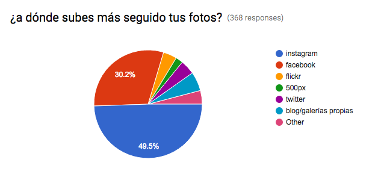
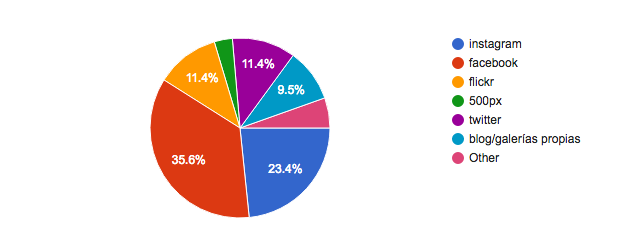
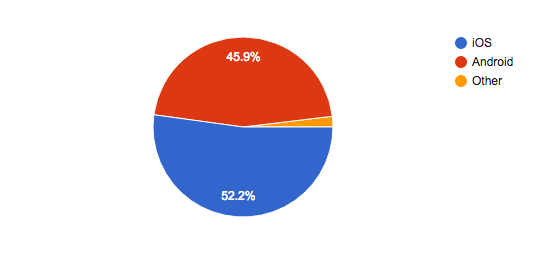
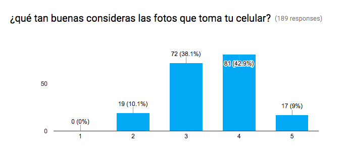
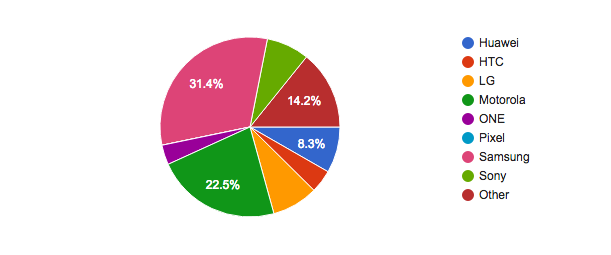
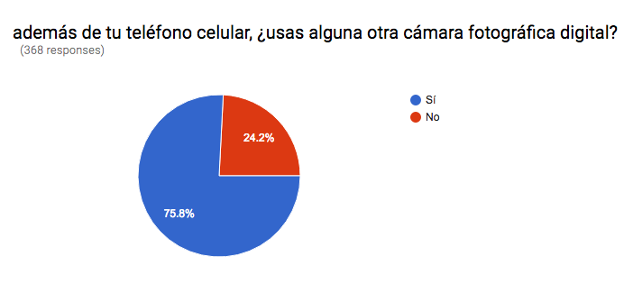
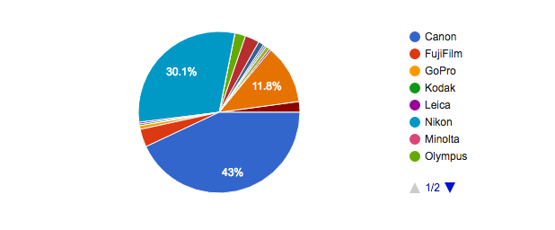

Hace unas semanas hice una encuesta de fotografía digital y usos comunes. Acá algunos resultados (se habla no-geek, números redondeados):

Por mucho, los servicios más usados para subir fotos son; como 1a opción:
- instagram 50%
- facebook 30%
- galerías propias 6%
- twitter/flickr 4%

…y como 2a opción para subir fotos se usa (mucho más disperso):
- facebook 36%
- instagram 23%
- flickr 11%
- twitter 11%
- galerías propias 10%

El 52% usa iPhone, el 46% Android y un 2% ninguno de los anteriores (y no me quiero imaginar nada :/).

En promedio, los dueños de iPhone (todos los modelos) le dan una calificación de 3.5/5 a la cámara; el 7+ evaluado en 4.1 y el 5 con 2.8/5.

En Android así califican la cámara por marca de teléfono (sobre 5):
- Motorola 3.0
- Huawei 3.2
- Samsung 3.3
- LG 3.3
- HTC 3.6
- Sony 3.9
- OnePlus 4

(OFF-TOPIC: La variedad de teléfonos Android es E-NOR-ME, +100 modelos registrados 😱, normalizados quedan en ~70)

Dos de cada tres fotos que se suben a redes sociales, son tomadas con el teléfono (67.1%).

Y una de cada cuatro personas no usa más cámaras que la del teléfono

Poca gente ha tomado un curso de fotografía (72%) pero en general están interesados en tomar uno (60%).

En marcas de cámaras "grandes" hay pocas sorpresas. Como primera y/o única cámara se tiene
- Canon 43%
- Nikon 30%
- Sony 12%
- Fuji 4%

Dueños de X que **SÍ** repetirían misma marca:
- Sony 63%
- Fuji 71%
- Canon 83%
- Nikon 86%

Dueños de X que **NO** repetirían misma marca:
- Canon 4%
- Nikon 6%
- Sony 7%
- Panasonic 16%
- GoPro 19%
- Samsung 50%

Los datos están en [github.com/beco/cameras](http://github.com/beco/cameras). Con esa información iré sacando más factlets. Cualquier duda/sugerencia, [saben dónde encontrarme](http://about.me/beco).
